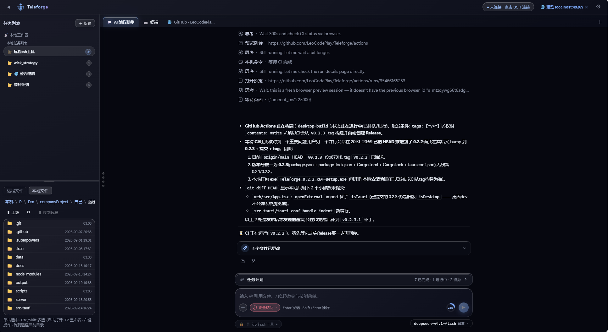

# Teleforge — 支持 SSH 远程与本地互通的 AI 编程工具

**语言 / Languages：[简体中文](README.md) · [English](README.en.md)**

一个本地运行的 Web 工具：通过 SSH 连接远程服务器并**保持连接**，让 **AI Agent 在远程服务器上真实地读写文件、执行命令、搜索代码**；未连接时则在本机工作区上执行同样的操作。远程与本地一套界面、一套工具，像把 AI 编程助手直接装进目标环境一样。


---

## 界面预览

<p align="center">
  
</p>

---

## 核心能力

**连接与访问**

- **SSH 连接保持**：10s 心跳保活，断线后按指数退避**自动重连**，实时状态展示；支持密码认证与私钥认证（含口令）。
- **连接配置保存**：把主机/端口/用户/认证方式/密码或密钥保存为命名配置（存于服务端 `server/data/ssh-profiles.json`，密码/私钥只留服务端、不下发前端），下拉即可在**多台服务器**间快速切换。
- **多服务器并行**：切换服务器**不会中断**正在回答的会话——它绑定原服务器继续在后台运行（工具操作仍作用于原服务器），会话列表里保留该「运行中」条目，切回后已生成的内容一条不少。
- **多浏览器同时在线**：支持多个浏览器窗口/标签同时连接——状态与 Agent 事件广播给全部在线端；所有端都断开期间产生的 Agent 事件会被**按序缓存**，任一端重连后自动补发，不会出现「后台已完成但界面还卡在生成中」。

**远程 ↔ 本地双工作区**

- **远程工作区**：连接后浏览远程文件系统，选任意目录作为工作区；Agent 的写/改/删以工作区为界，且**严禁删除工作区根目录**。
- **本地工作区**：未连接时进入本地模式，Agent 可在本机目录上执行**同样的操作**（读写/搜索/命令），远程与本地共用同一套界面与工具。
- **导航式文件管理**：按目录逐层浏览、双击打开；**多选**（Ctrl/Shift 点选、Ctrl+A 全选、Delete 删除），右键菜单对选区执行**删除/下载/复制/粘贴**；编辑保存由服务端做越权校验。
- **代码编辑器**：点击文本文件直接以 **CodeMirror 6 编辑器**打开——语法高亮（JS/TS/Python/Go/Rust/Java/C/C++/PHP/SQL/HTML/CSS/Markdown/YAML/XML/Shell 等）、行号/代码折叠/括号匹配/自动补全/搜索、撤销重做、右键菜单（剪切/复制/粘贴/复制路径），**Ctrl+S 保存写回**（远程写回 SFTP，越权由服务端校验；本地直接写盘）；保留文件原有行尾风格（LF/CRLF 整文件统一）。
- **媒体在线预览**：图片/视频/音频/PDF 点击即看——服务端按扩展名流式返回字节流（支持 **Range 请求**，视频/音频可拖动进度条），也可从预览直接下载。
- **文件查看器**：文本文件改动实时标脏，「保存修改」一键写回；二进制文件识别提示。

**AI Agent 编程**

- 对话式下达指令，Agent 通过工具在目标环境（远程或本地）**真实操作**：
  - `list_directory` 列目录 · `read_file` 读文件（分片读取、二进制识别）
  - `write_file` 写文件 · `edit_file` 精确文本替换
  - `run_command` 执行命令（**流式输出**、超时、输出截断：前 60k + 后 40k）
  - `create_directory` / `delete_path`（仅限工作区）· `get_workspace_info` 环境感知 · `search_code` 代码搜索（rg/grep）
- **工具有限循环**：单轮对话最大迭代 500 次；**并行工具调用**——读操作并发执行（有界并发池），写操作（写/改/删）互斥独占防止竞态，调用发起顺序严格保持模型顺序；工具开关可**持久化启停**（禁用后模型不可见也不可调用）。
- **长上下文治理**（多层防线，长任务不中断）：
  - **自动压缩续推**：按模型 `contextWindow` 实时估算上下文水位，超过阈值（可用窗口 × 80%）自动把早期对话**压缩为摘要**再继续；区间按位置选择并对齐工具配对边界——**单条指令引发的深度工具任务同样能中途压缩**；摘要生成失败自动降级为裁剪（保留原始任务锚点），对话永不因压缩失败中断。
  - **早期工具结果折叠**：投影到模型时，历史中早期的大体积工具结果自动折叠为「头 + 尾 + 回读指引」，事件日志保持完整（可回放/分支）。
  - **爆窗自恢复**：已配置模型窗口时，请求触发上游「超出上下文窗口」错误会自动折叠压缩历史并重试，无需人工干预。
  - 对话流中以**「上下文压缩」标记行**披露每次压缩（点击展开查看摘要）；`/compact` 可随时手动压缩（另有 `/clear` 清空历史、`/fork` 会话分支、`/help` 命令帮助）。
- **消息队列**：对话进行中继续发送的消息自动进入**待执行队列**，当前轮结束后按 FIFO 自动逐条执行；支持立即执行、撤回编辑、删除。
- **向用户提问**：模型需要补充信息时可暂停并向页面提问，等待你的回答后继续；多个会话的提问按序排队，不会互相覆盖。
- **上下文水位显示**：优先采用**提供方上报的真实 token 用量**（网关不报时回退启发式估算），悬浮展示分项明细（系统提示词 / 工具调用 / 对话消息）；各提供方可配置模型的输入/输出窗口。
- **@ 文件引用**：输入框输入 `@` 唤出工作区文件/文件夹候选菜单（远程 + 本地，即时模糊过滤），选中后以完整路径发给模型，精准指向要讨论的文件。
- **`/` 快捷指令**：输入 `/` 唤出系统命令（`/compact` 手动压缩等）与技能命令菜单。

**终端与命令台**

- **内置终端**：真实 PTY 交互式 shell（`/ws/term` 双工通道）。命令台右侧是**终端列表**：可**打开新的远程终端**（SSH 服务器的 PTY）或**新的本地终端**（本机 shell`cmd.exe`/`bash`），点「✕」删除当前终端（**至少保留一个**）。每个终端都是**独立常驻会话**：各自保有自己的屏幕/滚动缓冲与 shell 进程，切换只是显示/隐藏，互不影响、都持续保持连接；列表项上的状态点显示该会话的连接状态。
- **命令台**：手动执行命令，实时输出与退出码；「⏹ 停止」或 **Ctrl+C** 终止（先发 SIGINT，兜底强杀）。

**文件传输**

- 「⬆ 文件 / ⬆ 文件夹」上传本地文件/目录树到当前目录（带进度条，完成后自动刷新）；右键「⬇ 下载」文件直接下载、**文件夹流式打包 tar.gz** 下载。

**模型接入**

- 预置 20+ 主流提供商（DeepSeek / OpenAI / Kimi / 智谱 / 通义 / 豆包 / 千帆 / 混元 / 硅基流动 / 本地 Ollama·vLLM 等）；「＋」**添加自定义提供商**（名称/Base URL/模型清单/API Key，随时切换或删除）。
- 各提供方**记住上次使用的模型**；输入框下方一键切换提供方/模型；输入 `/` 唤出**快捷指令**（slash 命令）、输入 `@` 引用工作区文件；`mock` 模式可**离线联调**完整流程。

**会话与记忆**

- 多会话**切换/新建/重命名/删除/分支**（可从任意历史消息分支出新会话）；事件溯源日志持久化，**重启自动恢复**；新会话自动以首条指令命名。

**技能系统**

- 内置技能库，Agent 通过 skill 工具**按需加载** `SKILL.md` 指令；面板支持搜索/新建/编辑，内置技能可复制为可编辑副本。

**全局指令注入**

- 在设置中维护 prompt-inject 文本，自动作为**高优先级 system 指令**注入每次会话。

**主题与界面**

- 液态玻璃（Liquid Glass）风格的深色 IDE 界面；内置多套主题并支持**自定义主题**（设计 token 集中管理，一键套用）。
- **移动端适配**：手机（<768px）自动切换为**底部 Tab 单栏布局**（💬 AI 助手 / ⌨️ 终端 / 📁 文件），会话由顶栏 ≡ 抽屉唤出；平板为侧栏抽屉式。文件管理、会话等列表支持**长按唤出右键菜单**，编辑器自动处理软键盘遮挡（visual viewport 适配）。

## 快速开始

> 环境要求：**Node.js ≥ 22.18**。后端为纯 TypeScript，由 Node 直接运行（无需编译步骤）。

```bash
npm install        # 安装依赖
npm run build      # 构建前端(输出 web/dist)
npm start          # 启动服务 -> http://127.0.0.1:4000
```

开发模式（前端热更新）：

```bash
npm run dev        # 同时启动 server(:4000) 与 vite(:5173), 打开 http://127.0.0.1:5173
```

使用步骤：

1. 打开页面，填 **SSH 连接**（主机/端口/用户 + 密码或私钥），点「连接」
2. 连接后在「远程工作区」浏览选择目录作为工作区（或直接输入路径）
3. 在「AI 模型配置」填 Base URL / API Key / 模型名并保存（不填真实 Key 时可用 `mock` 体验）
4. 到「AI 编程助手」下达指令，如：「梳理一下这个项目的结构，然后修复 src/main.js 里的 bug」
5. 到「命令台」可手动执行命令验证

## 目录结构

```
.
├── package.json
├── tsconfig.json              # 前端 TS 配置
├── tsconfig.server.json       # 后端 TS 配置
├── server/                    # Node 后端(TypeScript,由 Node ≥22.18 直接运行)
│   ├── index.ts               # 入口:Fastify HTTP + WebSocket + 插件装配
│   ├── config.ts              # 端口 / 超时 / 输出上限等全局常量
│   ├── api/                   # 对外接口层
│   │   ├── http/              #   HTTP 路由(基础/提供商/传输/媒体流/tar 打包/UI 状态/静态托管)
│   │   └── rpc/               #   WS RPC 消息路由(router.ts 汇总各领域模块,含 ref.ts @文件引用候选)
│   ├── core/                  # 基础设施
│   │   ├── ssh-manager.ts     #   SSH 连接池:保活 / 自动重连 / SFTP / exec
│   │   ├── ws.ts              #   WebSocket 服务层(/ws RPC + /ws/term 真实 PTY)
│   │   ├── local-fs.ts        #   本地文件系统适配(与 SFTP 对齐签名)
│   │   ├── local-exec.ts      #   本地命令执行
│   │   └── transfer.ts        #   本地 ↔ 远程双向传输(逐项进度)
│   ├── agent/                 # AI Agent 引擎(事件溯源 + 工具有限循环)
│   │   ├── agent.ts           #   主循环:指令 → 流式 LLM → 工具 → 迭代
│   │   ├── session.ts         #   append-only 会话事件日志(唯一事实源)
│   │   ├── llm.ts             #   OpenAI 兼容流式客户端 + mock 离线联调
│   │   ├── tools.ts           #   工具定义与执行(读写/命令/搜索/提问…)
│   │   ├── registry.ts        #   工具注册 · schemas 白名单投影 · 守卫管线
│   │   ├── compact.ts         #   上下文窗口超限自动压缩续推
│   │   ├── ask-user.ts        #   模型向用户提问接缝
│   │   ├── prompt-inject.ts   #   全局指令注入(prompt-inject 管理)
│   │   └── tool-settings.ts   #   工具启用 / 禁用持久化
│   ├── store/                 # JSON 持久化(零依赖 · 原子写)
│   │   ├── session-store.ts   #   多会话事件日志 → 项目根 data/
│   │   ├── history-store.ts   #   跨轮对话记忆 → 项目根 data/
│   │   ├── ai-providers-store.ts  # AI 提供商配置 → server/data/
│   │   ├── ssh-profiles-store.ts  # SSH 配置(密码/私钥只存服务端)→ server/data/
│   │   └── ui-state-store.ts      # LLM 选择级 UI 状态 → server/data/
│   └── skills/                # 内置技能库(每个技能一个含 SKILL.md 的目录)
├── web/                       # 前端(React 18 + Vite + TS + SCSS)
│   ├── index.html
│   ├── vite.config.ts         # 开发代理 / 构建配置
│   ├── public/                # 静态资源(logo)
│   ├── LIQUID_GLASS.md        # 液态玻璃 UI 设计规范
│   └── src/
│       ├── main.tsx           # 入口
│       ├── App.tsx            # 布局与状态编排
│       ├── styles.scss        # 全局样式
│       ├── api/               # WS 客户端(自动重连 + 请求/应答)
│       ├── components/        # UI 组件(含 toolviews/ 工具调用视图)
│       ├── context/           # React 全局状态(feedback / llm-config)
│       ├── hooks/             # 自定义 Hook
│       ├── types/             # 共享类型
│       ├── utils/             # 工具函数(滚动条 / token 估算 / 工具行模型)
│       ├── data/              # 静态数据(预置 LLM 提供商)
│       └── theme/             # 主题系统(设计 token)
├── data/                      # 运行期数据:会话历史等(gitignore,不入库)
└── test/                      # 测试(基于本地 mock SSH 服务器,无需真实服务器 / API Key)
    ├── mock-ssh-server.js     # mock SSH 服务器(ssh2 Server 模式)
    ├── e2e.js                 # 全链路自动化测试
    └── *.test.js              # 会话/压缩/传输/本地执行等单元测试
```

## 运行测试

内置一个**本地 mock SSH 服务器**（无需真实服务器、无需 API Key 即可跑完全链路）：

```bash
npm test
```

覆盖：SSH 连接 → 平台探测 → 列目录 → 读文件 → 选工作区 → 写文件 → 命令执行（cd 前缀） → **Agent 完整工具循环**（列表/读/命令/写/总结），另有上下文压缩/工具结果折叠、RPC 注册表、长上下文优化冒烟等单元测试。

## 配置说明

| 项 | 位置 | 说明 |
|----|------|------|
| 监听地址/端口 | 环境变量 `HOST` / `PORT` | 默认 `127.0.0.1:4000`，仅本机访问 |
| 模型服务 | 界面「AI 模型配置」 | Base URL / Key / 模型名，自定义提供商存 `server/data/ai-providers.json` |
| SSH 服务器配置 | 界面「SSH 连接」 | 保存的配置存 `server/data/ssh-profiles.json`（密码/私钥只留服务端，不下发前端） |
| 工作区 | 界面「远程工作区」 | 每会话可换，Agent 的写/改/删被限制在该目录内 |
| 会话历史 | 项目根 `data/` | 多会话事件日志与跨轮记忆，重启自动恢复（gitignore，不入库） |

## 安全说明

- 服务**默认只监听 127.0.0.1**，有条件时建议再加反向代理 + HTTPS。
- **自定义提供商的 API Key 保存在本机 `server/data/ai-providers.json`**（明文，已 .gitignore，不入库）；首次启动会自动把 `~/.openclaw/openclaw.json` 里的提供商导入该配置。请勿用于共享/公网部署。
- Agent 的写/改/删操作被限制在**工作区目录内**，且禁止删除工作区根；命令执行有超时与输出上限。
- 建议用**单独的低权限账号 + 密钥登录**远程服务器，并谨慎让 Agent 执行破坏性命令。
- 本机拿根权限后本工具可读任意文件，属本地工具的正常风险。
- 除你配置的**模型提供商**外（对话内容需发送给它才能推理），所有操作和数据仅在运行本地和连接的 SSH 服务器上进行，不上传到任何第三方或作者服务器。

## 扩展路线 / Roadmap

已实现：内置终端（真实 PTY）、多服务器管理、上传/下载、多会话并行、长任务自动总结续推、代码编辑器与媒体预览、移动端适配。

尚在规划：

- Git 操作、错误自动回滚

## 贡献 / Contributing

欢迎 Issue 与 Pull Request！请确保：

- 代码遵循现有风格（TypeScript + SCSS，前端组件放 `web/src/components/`）。
- 新功能/修复附带对应测试（见 `test/`，测试基于本地 mock SSH 服务器，无需真实服务器）。
- 提交前运行 `npm run typecheck` 与 `npm test`。

## 许可证 / License

本项目基于 **GNU General Public License v3.0** 开源，详见 [LICENSE](LICENSE)。

Copyright (C) 2026 liaozhenqiang.